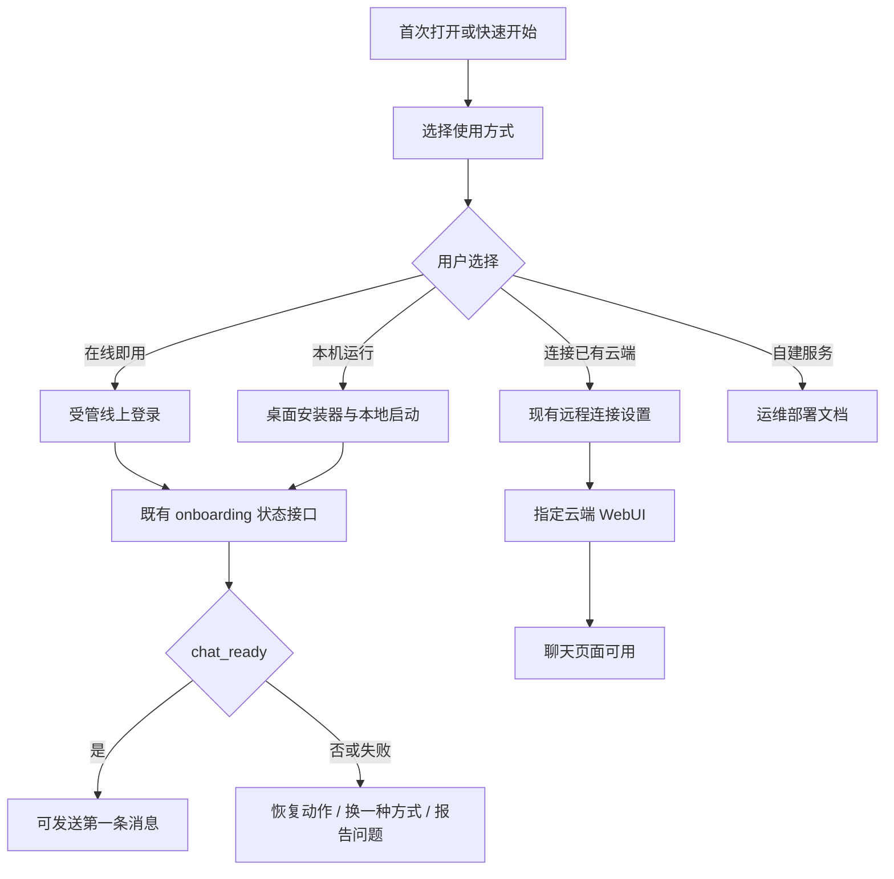

# 部署路径可发现性

## 问题与证据

首次接触产品的用户无法从一个明确入口判断自己应当使用线上还是本地方式，因而会在安装、远程连接与自建服务文档之间来回查找，或直接向支持求助。

近 24 小时内关联反馈 4 条，其中 3 条明确询问线上部署；反馈标识见本文 front matter。现有材料已经分别说明本机模式、云端模式和浏览器直连，但入口分散在 README、`docs/REMOTE_DEPLOY.md` 与运维向的 `docs/CLOUD_DEPLOY.md` 中。

## 用户与使用场景

1. **普通线上用户**：希望立即开始对话，不想安装软件或管理服务器。
2. **桌面用户**：需要访问本地工作区或文件，希望使用桌面安装器在本机运行。
3. **已有桌面版的远程用户**：希望桌面壳连接既有云端 URL，而不是在本机运行 Agent。
4. **运维人员**：需要自建云端服务；这不是终端用户的默认路径，仍应进入单独的运维文档。

## 目标

- 在所有首次使用入口提供一个可见的“选择使用方式”入口。
- 让用户用不超过两个问题选定线上或本地路径，并看到对应的最小可执行步骤、限制和完成判定。
- 将终端用户路径与“自建云端服务”的运维路径清楚分开，避免把运维命令误给普通用户。
- 复用现有 onboarding 的 `deployment_mode` 与状态机；选择路径后仍由服务端确认 `chat_ready` 才允许进入聊天。
- 通过匿名、最小化的漏斗事件判断用户是否完成选择并成功抵达首条消息。

## 非目标

- 不新增云服务器、计费、账号、OAuth 服务端规则或自动化自建部署能力。
- 不修改线上/本地 OAuth 回调限制，也不让客户端自行宣布聊天已就绪。
- 不把本机文件访问能力带到云端模式。
- 不替代完整的运维部署指南；`docs/CLOUD_DEPLOY.md` 仍面向运维人员。
- 不收集用户输入内容、令牌、URL 查询参数、工作区路径或会话内容作为埋点。

## 方案与交互流程

### 单一入口

在首次 onboarding 容器的起始位置，以及 README 的快速开始区域，提供同名入口：**“选择使用方式”**。入口不再使用含糊的“部署”作为唯一术语；页面标题说明这是“在哪里运行与如何连接”，避免用户把它误解为发布自己的应用。

入口展示三张互斥卡片：

| 选项 | 面向用户 | 主操作 | 关键提示 |
|---|---|---|---|
| 在线即用 | 想立刻使用、无需访问本机文件 | 打开受管线上地址并登录 | 不需要本机安装；云端看不到本机文件 |
| 本机运行 | 需要本机工作区或文件 | 下载/启动桌面安装器 | 首次准备可能需要数分钟；数据保留在本机 |
| 连接已有云端 | 已安装桌面版且已有云端 URL | 在“连接模式”填入受信任 URL | 云端工作区与本机工作区不同；可随时切回本机 |

卡片下方提供次级链接“我是运维人员，要自建云端服务”，仅跳转到 `docs/CLOUD_DEPLOY.md`，并明确标记其需要服务器、域名与运维权限。

### 选择后的最小路径

1. 用户选择一张卡片；客户端保存选择用于恢复页面，但不将其当作能力或登录状态。
2. 页面显示该路径的三项以内步骤、隐私/能力限制、返回选择的按钮和一个“查看完整说明”链接。
3. 线上即用：引导至受管线上地址；登录、套餐/模型同步与 readiness 继续交给既有线上 onboarding。
4. 本机运行：引导下载或启动现有桌面安装器；安装完成后由现有本地 onboarding 识别环境并继续。
5. 连接已有云端：复用现有“设置 → 连接模式 → 远程连接”流程与 `docs/REMOTE_DEPLOY.md`，不在此功能中重新实现 URL 校验或远程配置写入。
6. 用户完成路径动作后，展示对应的完成判定：线上路径为“登录后可发送第一条消息”；本机路径为“桌面应用启动并显示聊天”；远程连接为“重启后打开指定地址并显示聊天”。
7. 任一路径无法完成时，提供“换一种方式”“查看详细说明”和既有“报告问题”入口；不要求用户打开终端或粘贴诊断信息。

### 内容与术语规则

- 面向终端用户使用“在线即用”“本机运行”“连接已有云端”，避免把“自建云端部署”与“在线使用”混为一谈。
- 所有路径都在动作前说明是否可访问本机文件及数据保存位置。
- 受管线上地址、下载地址和文档链接由受版本控制的配置提供，禁止在多处硬编码。
- 中文与英文必须完整；其他语言可先回退英文，并沿用现有 i18n 机制。

## 状态与数据流

数据职责：

- 选择项是短期 UI 偏好，仅用于恢复引导与分析漏斗。
- `deployment_mode`、认证状态、provider 状态与 `chat_ready` 仍由现有服务端接口提供并作为唯一事实来源。
- 不因用户选择“在线即用”而改变本地 OAuth 回调限制；不因用户选择“本机运行”而伪造线上认证状态。

## 错误、恢复与边界条件

| 情况 | 用户可见行为 | 恢复动作 |
|---|---|---|
| 受管线上地址暂不可用 | 说明服务暂时无法连接，不显示内部错误 | 重试、查看状态说明、选择本机运行 |
| 桌面安装器启动失败 | 显示当前失败阶段和简短说明 | 重试、查看安装说明、报告问题 |
| 已有云端 URL 不可访问 | 说明无法连接该地址 | 修改 URL、切回本机、查看远程连接说明 |
| 用户刷新或重新打开 | 恢复其上次选择，但始终可返回选择页 | 更换使用方式 |
| 小屏或键盘操作 | 卡片纵向排列、焦点可见、可键盘选择 | 保持所有路径可达 |
| 用户从运维文档返回 | 保留原来的终端用户选择 | 返回选择使用方式 |

## 隐私与安全

- 不把私有云端 URL、OAuth 回调参数、JWT、API Key、本机路径或用户文本写入埋点。
- 远程 URL 的校验与保存沿用现有后端规则；本 PRD 不开放任意回调目标。
- “报告问题”继续使用现有脱敏、预览与明确确认机制。
- 运维自建文档必须保留其安全警告；终端用户卡片不得暗示公共云端适合敏感工作区。

## 埋点与效果指标

仅在用户已允许产品分析时发送以下白名单字段：

| 事件 | 字段 |
|---|---|
| `deployment_path_view` | surface, locale |
| `deployment_path_selected` | path, surface |
| `deployment_path_action_result` | path, result, error_code, duration_ms |
| `deployment_path_switched` | from_path, to_path |
| `deployment_path_help_opened` | path, help_type |

上线后连续观察 14 天：

- 从入口到选定一条路径的完成率 ≥ 85%。
- 选择后抵达对应完成判定的比例 ≥ 70%。
- “不知道如何线上/本机部署”的同类反馈量较发布前下降 ≥ 50%。
- 因本机文件能力或数据位置误解导致的反馈不高于发布前基线。

## 验收标准

- [ ] README 快速开始与首次 onboarding 都能进入同一个“选择使用方式”内容。
- [ ] 用户可在一个明确入口区分在线即用、本机运行和连接已有云端。
- [ ] 每条终端用户路径显示前置条件、最多三步的主操作、能力/隐私限制和完成判定。
- [ ] “自建云端服务”明确标记为运维路径，链接到既有运维文档，不与在线即用混淆。
- [ ] 用户可从任何路径返回并切换；刷新后保留选择，但不会绕过服务端 readiness。
- [ ] 在线和本机路径仍只有在既有 `chat_ready=true` 条件满足后才显示可开始对话。
- [ ] 线上不可达、安装失败、远程 URL 不可达均提供可理解的恢复操作与报告问题入口。
- [ ] 中文、英文、键盘操作、焦点状态和窄屏布局通过人工验收。
- [ ] 埋点只包含本文白名单字段，并在关闭分析时不发送非必要事件。

## 测试计划

- 单元测试：路径配置、文案键完整性、白名单埋点字段、恢复上次选择、非法选择值降级。
- 前端交互测试：三张卡片选择/返回/刷新恢复、键盘选择、焦点顺序、窄屏布局、中文与英文回退。
- 集成测试：线上、本机、远程三条路径均正确交给既有 onboarding 或远程设置；选择不修改 `deployment_mode`、认证状态或 `chat_ready`。
- 失败测试：线上地址不可用、安装失败、远程地址失败、帮助文档不可打开；每种情况都有恢复入口。
- 人工验收：Windows 10 首次用户完成本机路径；无安装用户完成在线路径；已有桌面用户配置远程连接并切回本机。

## 发布、回滚与线上验收

- 以功能开关或可回滚的导航入口发布，不改动认证和 provider 激活主路径。
- 发布前确认受管线上地址、安装下载地址与两份文档链接有效。
- 发布后在 staging 与生产分别走完三条终端用户路径，确认不出现虚假的“已就绪”。
- 监控上述漏斗与同类反馈 14 天；若错误率升高，可隐藏新入口并保留现有文档链接，随后回滚前端入口与埋点。
- 本 PRD 对应变更必须在发布说明中列出，并通过既有版本、CHANGELOG、测试与发布验证流程。

## 待人工决策

1. “在线即用”是否直接展示固定受管线上地址，还是只在网页入口提供跳转按钮？
2. 本机运行卡片是否在 Windows/macOS 自动展示各自下载入口，还是统一引导至下载页？
3. 已有桌面用户是否需要在首页显示“连接已有云端”，还是仅在设置中显示并由帮助页引导？
4. 是否把“自建云端服务”保留在首屏次级链接，还是仅放入帮助页以进一步降低普通用户的认知负担？
